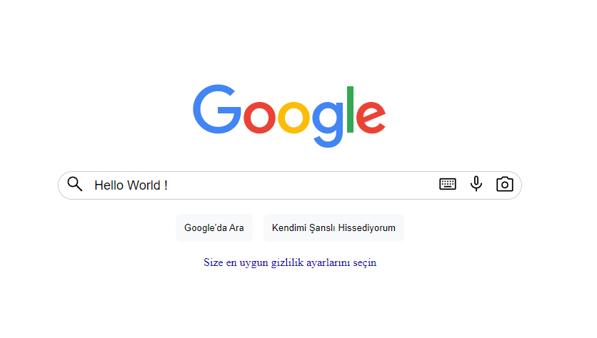

# Google Search Page

This project is a simple Google search page created using only HTML and CSS. It aims to replicate the basic layout and design of Google's search interface.

## Project Overview

This Google search page includes the following features:

- **Search Bar**: A central search bar for entering search queries.
- **Google Logo**: A placeholder for the Google logo at the top of the page.
- **Search Buttons**: Buttons for performing searches, styled to match Google's interface.
